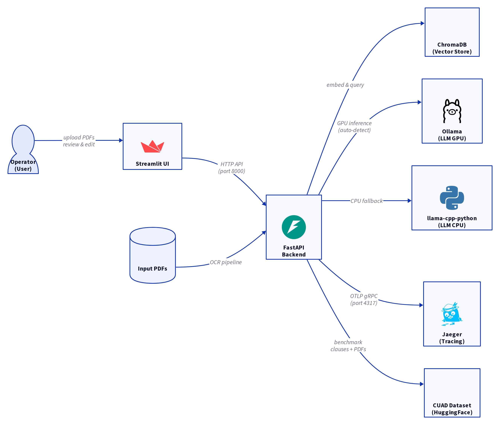
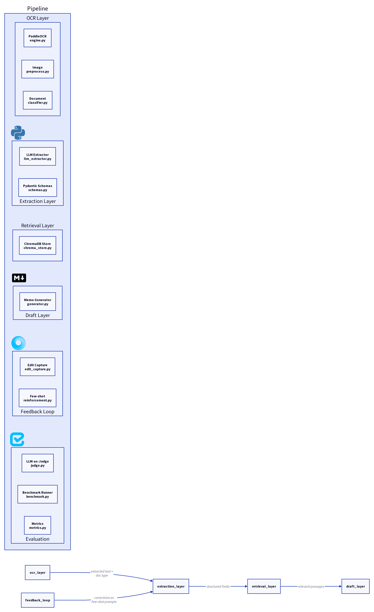
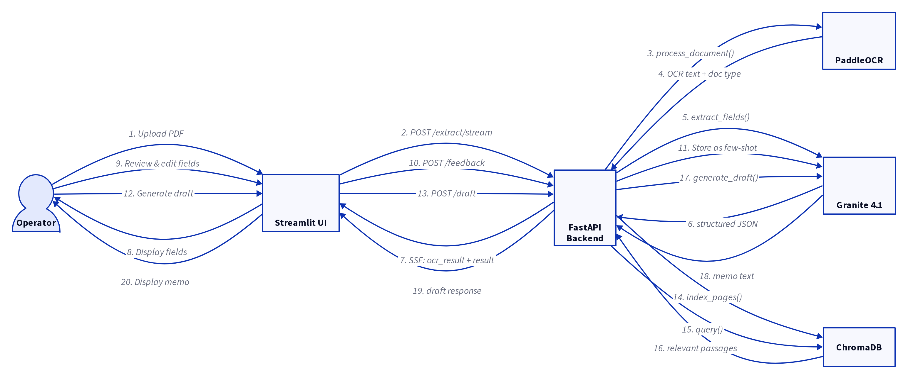
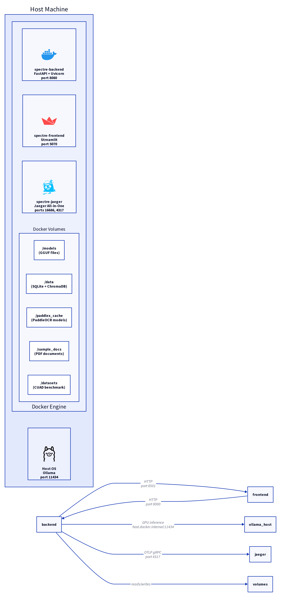

# Spectre — Legal Document Extraction Pipeline

Extract structured data from legal documents (fee proposals, engagement letters, NDAs, contracts)
using PaddleOCR + Granite 4.1 LLM. GPU accelerated via Ollama, with automatic CPU fallback.

---

## Quick Start

### Prerequisites

| Requirement | Notes |
|------------|-------|
| **Docker Desktop** | Must be running. Any recent version works. |
| **RAM** | 8 GB minimum (16 GB recommended with GPU) |
| **Disk space** | ~5 GB (Docker images + model) |
| **CPU** | Any modern x86_64 processor |
| **GPU (optional)** | NVIDIA with 4 GB+ VRAM (RTX 3050 tested) |
| **Ollama (optional)** | Install for GPU acceleration — see below |

### One Command to Run (Basic)

```bash
git clone <repo-url>
cd spectre
docker compose up --build
```

### One Command to Run (With GPU)

```bash
# Step 1: Install Ollama (outside Docker, on your host)
curl -fsSL https://ollama.com/install.sh | sh
ollama pull granite4.1:3b

# Step 2: Start the stack
docker compose up --build
```

The backend auto-detects Ollama on your host. If found, uses GPU. If not, falls back to CPU.

### First Run Times

| Step | Duration | Notes |
|------|----------|-------|
| Docker image build | ~8-12 min | One-time — downloads packages |
| Container startup | ~3 sec | Second run onward |
| Ollama model pull | ~3-5 min | Only if using GPU; one-time |
| CPU model load | ~30 sec | First request loads the model |
| GPU model load | ~2 sec | Ollama keeps model in memory |

### Access

| Service | URL |
|---------|-----|
| **Frontend (Streamlit)** | http://localhost:5070 |
| **API Docs (Scalar)** | http://localhost:8080/docs |
| **API Health** | http://localhost:8080/health |
| **Jaeger Tracing UI** | http://localhost:16686 |

---

## Performance: GPU vs CPU

Tested with a 12-page legal contract (~300 KB PDF):

| Metric | GPU (RTX 3050 4 GB) | CPU (Ryzen 4800H, 4 threads) |
|--------|--------------------|--------------------------|
| **OCR (PaddleOCR)** | ~30 sec | ~30 sec |
| **LLM extraction** | **~30 sec** | **~5-10 min** |
| **Total per document** | **~1 min** | **~6-10 min** |
| **Model load time** | ~2 sec | ~30 sec |
| **GPU memory used** | ~2.1 GB | N/A |

**TL;DR:** GPU is 10-20x faster. Both produce identical results. The system works without GPU — just slower.

---

## Usage

### Via Streamlit UI

1. Open http://localhost:5070
2. Upload a PDF from `sample_docs/` or upload any legal doc from the internet
3. Click **🚀 Extract**
4. Switch tabs to view/edit results, generate drafts, evaluate

### Via API

Full interactive API documentation at http://localhost:8080/docs (Scalar UI with Elysia.js theme).

| Endpoint | Method | Description |
|----------|--------|-------------|
| `/docs` | GET | Scalar API reference (interactive docs with test requests) |
| `/health` | GET | Service health check |
| `/upload` | POST | Upload PDF → OCR text + document classification |
| `/extract` | POST | Upload → OCR → LLM-structured extraction |
| `/draft` | POST | Generate grounded legal memo with citations |
| `/feedback` | POST | Submit operator edits for the improvement loop |
| `/evaluate` | POST | Run evaluation metrics against ground truth |

### API Examples

```bash
# Health check
curl http://localhost:8080/health

# Upload and OCR a PDF
curl -X POST -F "file=@sample_docs/fee_proposal_test.pdf" http://localhost:8080/upload

# Upload and extract structured fields
curl -X POST -F "file=@sample_docs/contract.pdf" http://localhost:8080/extract

# Get API reference in browser
open http://localhost:8080/docs
```

### Sample Upload Response

```json
{
  "file_name": "fee_proposal_test.pdf",
  "doc_type": "fee_proposal",
  "page_count": 1,
  "confidence": 0.997,
  "full_text": "FEE PROPOSAL",
  "pages": [
    {"page": 1, "text": "FEE PROPOSAL", "confidence": 0.997}
  ]
}
```

### Sample Extraction Response (GPU)

```json
{
  "file_name": "contract.pdf",
  "doc_type": "legal_generic",
  "ocr_confidence": 0.987,
  "extracted": {
    "document": {
      "type": "contract",
      "title": "Agreement between Firmwide, Inc. and Shahriar Shatil",
      "parties": [
        {"name": "Firmwide, Inc.", "representative": "Ryan Matthew Chan"},
        {"name": "Shahriar Shatil"}
      ]
    }
  }
}
```

---

## Architecture

### System Context



The system consists of a Streamlit frontend, a FastAPI backend, and Jaeger for distributed tracing. LLM inference runs either on GPU via host Ollama or CPU via llama-cpp-python (auto-detected). Documents are stored in ChromaDB for semantic retrieval.

See [System Overview](architecture-docs/01-overview.md) for the full request lifecycle, three wire contracts, and known issues.

### Module Architecture



The backend is organized into 6 layers: OCR, extraction, retrieval, draft generation, feedback loop, and evaluation. Each layer is independently tested and replaceable.

See [Integration](architecture-docs/02-integration.md) for API contracts, data flow diagrams, and the per-field reliability table.

### Request Lifecycle



A full document processing run follows 20 steps from upload through to draft generation, with the feedback loop improving future extractions.

See [Frontend Flow](architecture-docs/03-frontend-flow.md) for SSE stream processing, session state management, and UI tab details.

### Deployment Topology



All three services run in Docker containers. The host runs Ollama for GPU inference. Jaeger receives traces via OTLP gRPC.

See [Deployment](architecture-docs/04-deployment.md) for the environment matrix, volume mounts, and Dockerfile details.

### Tech Stack

| Component | Choice | Why |
|-----------|--------|-----|
| **OCR** | PaddleOCR 3.5.0 (PP-OCRv5) | Best accuracy for messy documents |
| **LLM** | Granite 4.1 3B | Apache 2.0, lightweight, runs on 4 GB GPU |
| **GPU runner** | Ollama (on host) | Simplest GPU setup, auto-detected |
| **CPU fallback** | llama-cpp-python | Works when Ollama isn't installed |
| **Backend** | FastAPI + Uvicorn | Auto-generated OpenAPI spec |
| **API Docs** | Scalar (Elysia.js theme) | Interactive API reference with test requests |
| **Frontend** | Streamlit | Simple file upload + results display |
| **Database** | SQLite | Zero setup, file-based |
| **Vector Store** | ChromaDB | Embedded, in-process |
| **Tracing** | Jaeger + OpenTelemetry | Distributed tracing via OTLP gRPC |
| **Package mgr** | uv | 10x faster pip resolution |

### Benchmark Results

| Benchmark | Score | Notes |
|-----------|-------|-------|
| **OCR Accuracy** | 2.41% CER | Character Error Rate on CUAD PDFs |
| **Extraction Quality** | 81% | Grounding rate x (1 - hallucination rate) |
| **Classifier** | 22% | Keyword classifier on standalone clauses (no document header) |

---

## Project Structure

```
├── docker-compose.yml           # 3 services: backend, frontend, jaeger
├── .env.example                 # All env vars with documentation
├── architecture-docs/           # Full architecture documentation + D2 diagrams
│   ├── 01-overview.md
│   ├── 02-integration.md
│   ├── 03-frontend-flow.md
│   ├── 04-deployment.md
│   └── diagrams/                # D2 source + rendered SVG/PNG
├── backend/
│   ├── Dockerfile
│   ├── pyproject.toml           # All deps pinned to exact versions
│   ├── entrypoint.sh            # Starts server, model handled by Ollama
│   └── app/
│       ├── main.py              # FastAPI app + 10 API routes
│       ├── config.py            # Environment config
│       ├── models.py            # Pydantic schemas per doc type
│       ├── ocr/                 # PaddleOCR engine + document classifier
│       ├── extraction/          # LLM extraction with schema enforcement
│       ├── retrieval/           # ChromaDB vector store
│       ├── draft/               # Draft generation with citations
│       ├── feedback/            # Operator edit capture + reinforcement
│       ├── evaluation/          # LLM-as-judge + 3 benchmark modes
│       └── telemetry/           # OpenTelemetry tracing for Jaeger
├── frontend/
│   ├── Dockerfile
│   ├── app.py                   # Streamlit UI (upload, edit, draft, eval)
│   └── requirements.txt
├── datasets/                    # CUAD evaluation data (downloaded on demand)
├── sample_docs/                 # Test PDFs
└── paddlex_cache/               # PaddleOCR model cache (auto-generated, gitignored)
```

---

## Project Screenshots
### Home Page


### Document Extraction


### Draft Generation 


### Eval Benchmarks


### API Docs


### Jaeger Observability


## Docker Build Troubleshooting

| Issue | Root Cause | Fix Applied |
|-------|-----------|-------------|
| Build hangs 10+ min on pip install | pip SAT resolver backtracking on chromadb + paddleocr deps | Replaced pip with **uv** — resolves 127 packages in 8 seconds |
| `llama-cpp-python` tries to compile from source | No prebuilt wheels on PyPI | Added `--find-links` to fetch wheels from GitHub releases |
| `Permission denied: /usr/local/...` | uv/pip install running as non-root user | Moved pip install to before `USER user` in Dockerfile |
| `streamlit: command not found` | Binary installed to `~/.local/bin/` not on PATH | Added `ENV PATH=/home/user/.local/bin:$PATH` |
| Browser can't connect to port 5060 | Docker Desktop port forwarding quirk on certain ports | Changed to port **8080** (standard HTTP port) |
| `Model not found` at startup | File name mismatch in MODEL_PATH env var | Corrected to `ibm-granite_granite-4.1-3b-Q4_K_M.gguf` |
| `ConvertPirAttribute2RuntimeAttribute` error | PaddlePaddle 3.3.1 PIR executor bug | Downgraded to `paddlepaddle==3.2.2` |
| `huggingface-cli: deprecated` | Old CLI replaced by `hf` | Updated entrypoint to use `hf download` |
| PaddleOCR model downloads on every container recreate | Model files stored in container, not volume | Files auto-download once then cache in `~/.paddlex/` |
| Ollama unreachable from Docker container | Docker Desktop networking | Added `extra_hosts: host.docker.internal:host-gateway` |

---


# I Rest My Case


