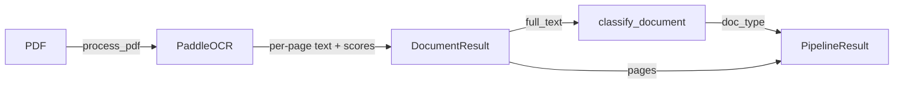
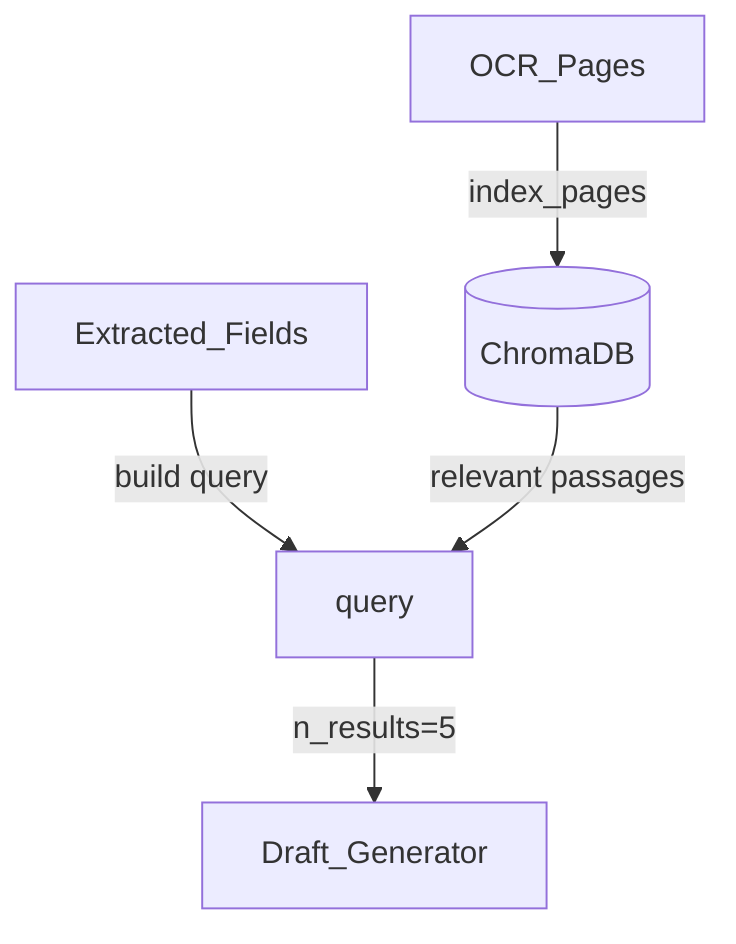
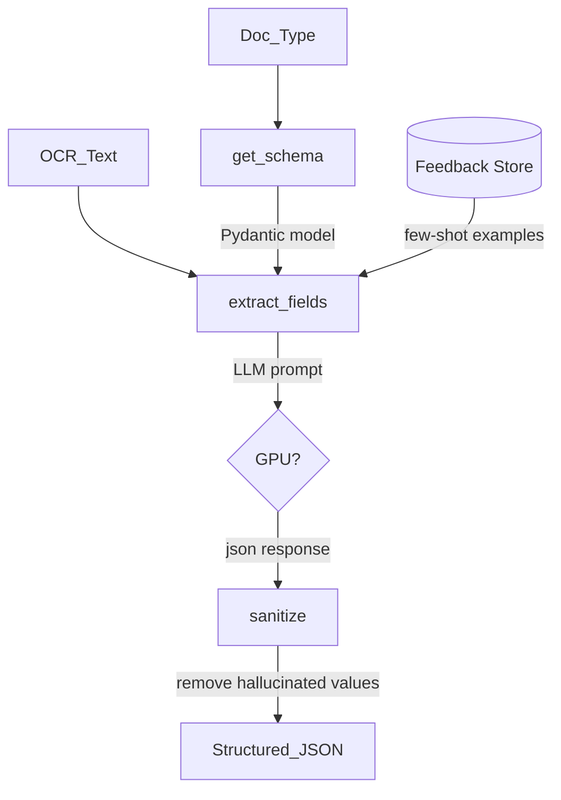

# Integration Architecture

## Module / Component Map


The backend is organized into 5 layers, each with a clear responsibility:

### OCR Layer

| Module | File | Responsibility |
|--------|------|---------------|
| **Engine** | `ocr/engine.py` | PaddleOCR singleton with thread-safe lock, PDF page OCR |
| **Preprocess** | `ocr/preprocess.py` | Image preprocessing (deskew, denoise, binarize) |
| **Classifier** | `ocr/classifier.py` | Keyword-based document type detection (NDA, MSA, etc.) |
| **Pipeline** | `ocr/pipeline.py` | Orchestrates OCR + classification into a single `PipelineResult` |

### Extraction Layer

| Module | File | Responsibility |
|--------|------|---------------|
| **LLM Extractor** | `extraction/llm_extractor.py` | Auto-detect GPU/CPU, call LLM with schema-enforced prompts |
| **Schemas** | `extraction/schemas.py` | Schema registry mapping doc types to Pydantic models |
| **Pydantic Models** | `models.py` | 5 extraction schemas: NDA, MSA, Engagement Letter, Fee Proposal, Generic |

### Retrieval Layer

| Module | File | Responsibility |
|--------|------|---------------|
| **ChromaDB Store** | `retrieval/chroma_store.py` | Vector store with page-aware indexing, chunking, and semantic search |

### Draft Layer

| Module | File | Responsibility |
|--------|------|---------------|
| **Generator** | `draft/generator.py` | 4-section legal memo with `[Source: page X]` citations, streaming variant |

### Feedback Loop

| Module | File | Responsibility |
|--------|------|---------------|
| **Edit Capture** | `feedback/edit_capture.py` | Store operator corrections as `CorrectionPair` objects |
| **Reinforcement** | `feedback/reinforcement.py` | Format corrections as few-shot examples for extraction prompts |

### Evaluation

| Module | File | Responsibility |
|--------|------|---------------|
| **Judge** | `evaluation/judge.py` | LLM-as-judge scoring (context relevance, faithfulness, hallucination rate) |
| **Metrics** | `evaluation/metrics.py` | CER/WER computation, `EvaluationResult` dataclass |
| **Benchmark** | `evaluation/benchmark.py` | 3 benchmark modes: classifier, OCR, extraction |

---

## API Contracts

### POST /extract/stream — Upload + OCR + Extract (SSE)

**Request:** `multipart/form-data` with `file` field containing a PDF.

**Response:** Server-Sent Events stream:

```
event: progress
data: {"step": "ocr", "message": "Running OCR (7-60 sec)...", "pct": 10}

event: ocr_result
data: {"file_name": "nda.pdf", "doc_type": "nda", "page_count": 3, "confidence": 0.92, "full_text": "...", "pages": [...]}

event: result
data: {"ocr": {...}, "extracted": {"parties": [...], "effective_date": "2024-01-15", ...}}
```

### POST /draft — Generate Grounded Memo

**Request:**
```json
{
  "extracted_data": {"parties": ["Acme Corp"], "effective_date": "2024-01-15"},
  "ocr_text": "NON-DISCLOSURE AGREEMENT...",
  "pages": [{"page": 1, "text": "..."}],
  "doc_id": "nda.pdf"
}
```

**Response:**
```json
{
  "draft": "# Review Memo\n\n## Parties\n[Source: page 1]\n- Acme Corp\n\n## Key Terms\n...",
  "evidence_count": 3
}
```

### POST /feedback — Submit Operator Corrections

**Request:**
```json
{
  "original": {"effective_date": "2024-01-15"},
  "corrected": {"effective_date": "2024-01-16"},
  "document_type": "nda"
}
```

**Response:**
```json
{
  "status": "accepted",
  "corrections_count": 1,
  "changed_fields": ["effective_date"]
}
```

### POST /benchmark — Run Pipeline Benchmarks

**Request:**
```json
{
  "mode": "classifier",
  "num_samples": 200
}
```

**Response (classifier mode):**
```json
{
  "mode": "classifier",
  "num_samples": 200,
  "overall_accuracy": 0.2195,
  "per_doc_type": {"nda": {"accuracy": 0.0, "count": 4, "correct": 0}, ...},
  "per_clause_type": {"Non-Compete": {"accuracy": 0.0, "count": 1, "correct": 0}, ...},
  "keyword_coverage": {"nda": {"keyword_coverage": 0.0, "samples": 4}, ...}
}
```

---

## Data Flow Diagrams

### OCR Pipeline Flow



### ChromaDB Retrieval Flow



### LLM Extraction Flow



---

## Known Issues

| # | Concern | Location |
|---|---------|----------|
| 1 | Classifier only 22% accuracy on individual CUAD clauses (no document header context) | `classifier.py:69-90` |
| 2 | LLM field name aliases require `_normalize_field_names()` post-processing | `llm_extractor.py:148-170` |
| 3 | ChromaDB embedding model downloaded on first query (~80 MB) | `chroma_store.py:14-22` |
| 4 | Summary fields auto-exempted from grounding check in benchmarks | `benchmark.py:448-460` |
